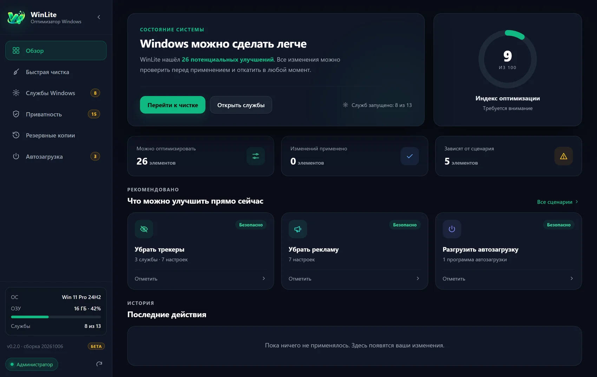
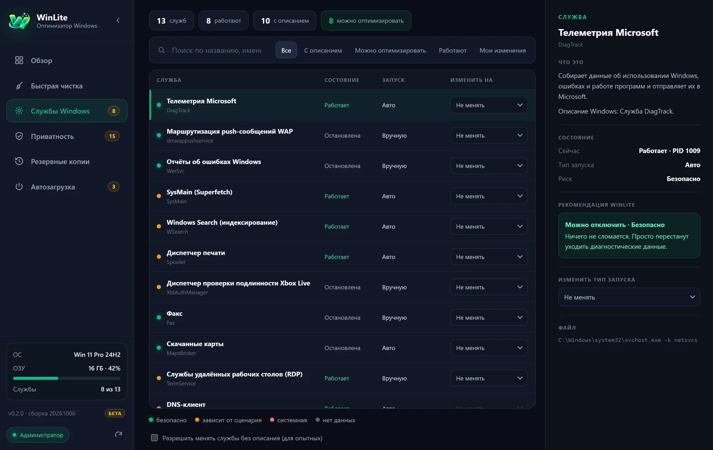

# WinLite

**Лёгкий оптимизатор Windows: службы с понятными пояснениями, отключение рекламы и слежки, управление автозагрузкой. Всё с резервной копией и откатом в один клик.**

*A lightweight Windows optimizer: services explained in plain language, ads and tracking switched off, startup manager. Everything is backed up and reversible.* ([English summary below](#english))



> **Бета-версия 0.2.0.** Программа меняет системные настройки. Перед применением WinLite показывает полный список изменений и сохраняет прежнее состояние, но используйте её осознанно и на свой риск (см. [лицензию](LICENSE)).

Страница проекта: **https://dreamskies.dev/winlite/**

## Возможности

| Раздел | Что делает |
|---|---|
| **Службы Windows** | Показывает все службы с описанием на русском: за что отвечает, что будет при отключении, кому нужна, уровень риска. Для неизвестных служб есть кнопка «Найти в интернете». |
| **Быстрая чистка** | Готовые сценарии: убрать трекеры, убрать рекламу, службы для отсутствующего железа, лишние сетевые службы, разгрузка памяти и диска, автозагрузка. Сначала вы видите полный список изменений. |
| **Приватность** | 16 настроек реестра: реклама в «Пуске», «Параметрах» и на экране блокировки, рекламный ID, телеметрия, история действий и др., у каждой описаны последствия. |
| **Автозагрузка** | Программы, стартующие вместе с Windows, с иконками и описаниями. Включение и отключение работает как в Диспетчере задач: ничего не удаляется. |
| **Резервные копии** | Перед каждым применением сохраняется прежнее состояние. Любую копию можно откатить одной кнопкой. |



## Принципы безопасности

- **Отключение, а не удаление.** Службы переключаются в «Отключена»/«Вручную», записи автозагрузки гасятся флагом, как в Диспетчере задач. Исходные данные остаются на месте.
- **Защищённый список.** 41 критичная служба (RPC, DNS, брандмауэр, Defender и др.) заблокированы на уровне программы: интерфейс не может их изменить.
- **Белый список реестра.** WinLite меняет только значения из зашитого в программу списка, интерфейс передаёт лишь идентификаторы настроек.
- **Копия до изменений.** Снимок состояния записывается на диск *до* применения. Откат восстанавливает прежние значения (а для значений, которых не было, удаляет добавленные).
- **Точка восстановления Windows с проверкой.** Windows создаёт не больше одной точки в сутки и молча пропускает повторные запросы. WinLite проверяет, что новая точка действительно появилась, и честно сообщает, если нет.
- **Без телеметрии.** Программа не отправляет никаких данных. Единственные сетевые действия: открытие поиска Google в браузере по вашему клику.

Копии хранятся в `%APPDATA%\WinLite\snapshots\` (обычный JSON, их можно открыть и прочитать).

## Установка

1. Скачайте `WinLite-0.2.0-portable.zip` на странице [Releases](../../releases) и сверьте SHA-256 с `SHA256SUMS.txt`.
2. Распакуйте и запустите `winlite.exe`. Установка не требуется.
3. Программа запрашивает права администратора (UAC): без них изменения применить нельзя, но просматривать можно.

**Windows SmartScreen.** Бета-версия пока не имеет цифровой подписи, поэтому SmartScreen может показать «Windows защитила ваш компьютер». Нажмите **Подробнее → Выполнить в любом случае**. Исходный код открыт, вы можете собрать программу сами (см. ниже) или проверить хеш файла. Некоторые антивирусы могут ложно срабатывать на утилиты, меняющие службы и реестр: если это случилось, добавьте файл в исключения или соберите из исходников.

**Требования:** Windows 10 или 11 (x64), WebView2 Runtime (есть в Windows 11 и в актуальных Windows 10; при отсутствии установите с сайта Microsoft).

## Сборка из исходников

Нужны [Rust](https://rustup.rs/) (stable), Node.js 18+ и Visual Studio Build Tools (C++).

```bash
npm install
npm run build        # exe появится в src-tauri/target/release/winlite.exe
npm run dev          # режим разработки (без прав администратора: только просмотр)
```

Интерфейс (`src/`) написан на чистых HTML/CSS/JS без сборщика, бэкенд (`src-tauri/src/main.rs`) на Rust + Tauri 2. Если открыть `src/index.html` в обычном браузере, работает демо-режим на тестовых данных.

## База знаний

Описания служб лежат в [`src/kb.js`](src/kb.js), настройки реестра и пресеты в [`src/presets.js`](src/presets.js). Поправить описание или добавить службу или программу автозагрузки можно обычным pull request: формат записей виден в самих файлах. Особенно полезны описания вендорских служб (ASUS, NVIDIA, Logitech и др.).

## Планы

- Автозагрузка через планировщик задач.
- Потребление памяти по службам.
- Проверка обновлений и установщик.
- Английский интерфейс.

## Поддержать проект

WinLite бесплатна и открыта. Если она вам помогла, можно сказать «спасибо»:

- [Patreon](https://www.patreon.com/DreamSkies/membership)
- [ЮMoney](https://yoomoney.ru/fundraise/1KGTK8NPPQN.260925) (для России)
- [Криптовалюта (OxaPay)](https://pay.oxapay.com/14606636)

## Лицензия

[MIT](LICENSE) © 2026 DreamSkies. WinLite не связана с Microsoft; Windows — товарный знак Microsoft Corporation.

---

## English

**WinLite** is a free, open-source (MIT) Windows 10/11 optimizer built with Tauri 2 and Rust. It lists Windows services with plain-language explanations (currently in Russian), switches off ads and tracking via a whitelist of registry values, manages startup programs the same way Task Manager does, and **backs up the previous state before every change, with one-click rollback**. It never deletes anything, protects 41 critical system services from being touched, verifies that a Windows restore point was actually created, and sends no telemetry.

**Install:** download `WinLite-0.2.0-portable.zip` from [Releases](../../releases), verify the SHA-256 against `SHA256SUMS.txt`, unzip and run `winlite.exe` (UAC prompt for admin rights). The beta is not code-signed, so SmartScreen may warn: click *More info → Run anyway*, or build from source (`npm install && npm run build`).

**Status:** beta. It changes system settings: review the change list before applying, use at your own risk. UI language is currently Russian only; English UI is on the roadmap.
